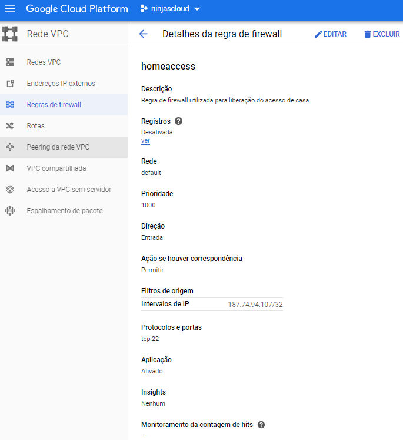
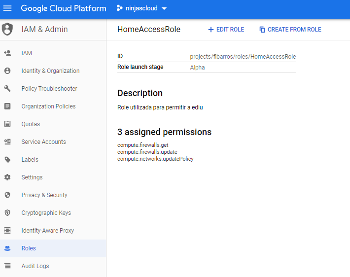
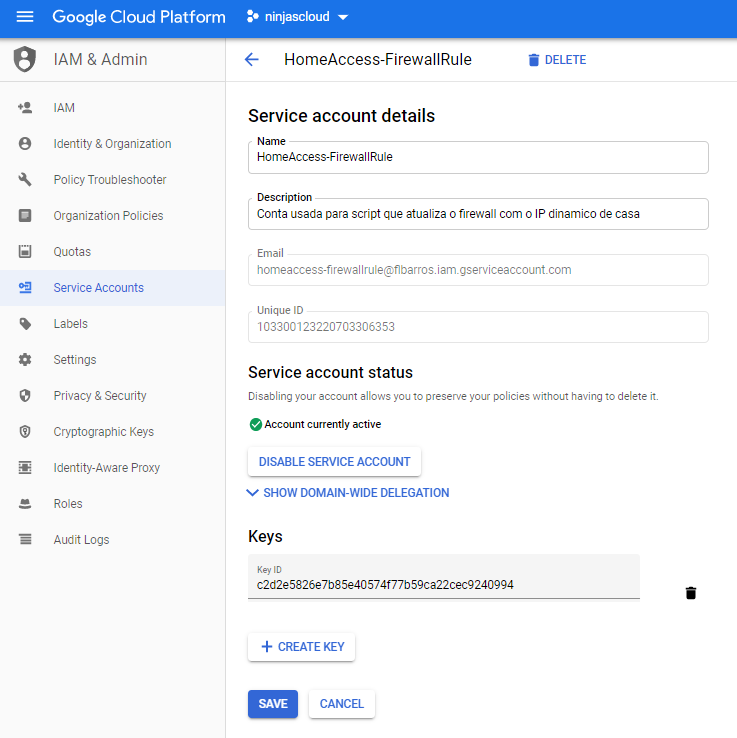

# GCP - Home Access

### Propósito
Este script foi criado para agilizar a atualização do novo IP dinâmico nas regras de firewall no GCP quando estou trabalhando de casa

### Roadmap
- Nada a fazer

### Requerimentos em ambiente Ubuntu
| Packages | Info | Referência |
| ------ | ------ | ------ |
| NodeJS |  |  |
| NPM |  |  |
| request | Pacote NPM |  |
| @google-cloud/compute | Pacote NPM |
| gcloud | Linha de comando do GCP no Ubuntu | https://cloud.google.com/sdk/docs/quickstart-debian-ubuntu |
| Firewall | Configuração de regra de firewall no GCP | https://cloud.google.com/filestore/docs/configuring-firewall?hl=pt-br |
| Conta de Serviço | Configuração de conta de Serviço no GCP | https://cloud.google.com/iam/docs/creating-managing-service-accounts?hl=pt-br |
| Role e IAM | Configuração de role customizada no GCP | https://cloud.google.com/iam/docs/creating-custom-roles?hl=pt-br |

### Instalação e configuração

- clone o repositório 
```sh
$ cd workspace
$ git clone 
$ cd gcp_home_access
```
- instale o nodejs e as dependências se ainda não tiver instalado
```sh
$ sudo apt update
$ sudo apt install -Y nodejs npm
$ npm install request --save
$ npm install --save @google-cloud/compute
```
- Crie uma regra de firewall no GCP chamada `homeaccess`



- Crie uma regra role customizada no GCP chamada `HomeAccessRole` e adicione as seguintes politicas na role.
```sh
compute.firewalls.update
compute.networks.updatePolicy
compute.firewalls.get
```


- Crie uma conta de serviço chamada `homeaccess-firewallrule`, ela será usada pelo script para acessar o GCP e fazer a atualização do firewall. Ao criar essa conta de serviço, será um arquivo `.json`, salve esse arquivo com o nome `homeaccess-firewallrule.json`.



### Links de Referência
APIs do Google para Developers - https://googleapis.dev/nodejs/compute/latest/Firewall.html#setMetadata
Como utilizar a bilioteca do Google para Nodejs - https://cloud.google.com/compute/docs/tutorials/nodejs-guide#setup
Como definir a autenticação da aplicação (Foi aqui que vi como usar o json local ao invés de variaveis de ambiente) - https://cloud.google.com/docs/authentication/production#auth-cloud-implicit-nodejs
Documentação com especificação do Google sobre cada politica de segurança - https://cloud.google.com/compute/docs/access/iam?hl=pt-br
Repositorio com exemplos de código do GitHub - https://github.com/googleapis/google-api-nodejs-client/blob/master/samples/compute/listVMs.js  |  https://cloud.google.com/compute/docs/tutorials/nodejs-guide?hl=pt-br
Guia de como buscar a informação do IP através de uma outra requisição de API - https://medium.com/@danielpereira_81312/integra%C3%A7%C3%A3o-de-uma-api-utilizando-endere%C3%A7o-ip-node-js-58fb9086a99
Exemplos de Markdown - https://dillinger.io/

